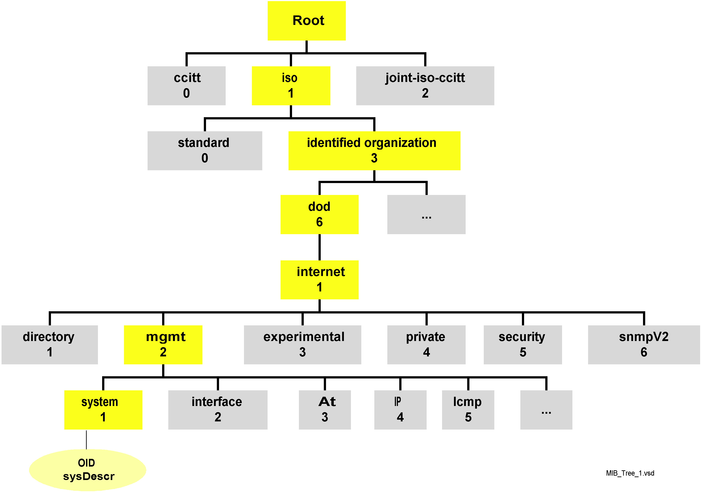

[TOC]

### SNMP and UDP

SNMP uses the User Datagram Protocol (UDP) as the transport protocol for passing data between managers and agents. SNMP uses timeout to determine if datagrams are lost. The number of times the NMS retransmits packets is also configurable.

SNMP uses UDP port 161 for sending and receiving requests and port 162 for receiving traps from managed devices.

### SNMP Communities

SNMPv1 and SNMPv2 use the notion of communities to establish trust between managers and agents. An agent is configured with three community names : read-only, read-write, and trap. The community names are essentially passwords.

When setting up an SNMP agent, you will want to configure its trap destination, which is the address to which it wuill send any traps in generates. In addition, which is the address to which it will send any traps it generates. You can configure an agent to send an SNMP authentication-failure trap when someone attempts to query your device with an incorrect community string. Among other things, authentication-failure traps can be very useful in determining when an intruder might be trying to gain access to your network.

You can configure your firewall to allow UDP traffic from only a list of known hosts to reduce your risk of attack.

One way to protect your community strings is to use a Virtual Private Network (VPN) to make sure your network traffic is encrypted. Another way is to write a simple Perl script that uses SNMP to change the community strings on your devices.

### The Structure of Management Information
The definition of managed objects can be broken down into three attributes:

#### Name
The name, or object identifier (OID), uniquely defines a managed object. Names commonly appear in two forms: numeric and "human readable." 

#### Type and syntax
A managed object's datatype is defined using a subset of Abstract Syntax Notation One (ASN.1). ASN.1 is a way of specifying how data is represented and transmitted between managers and agents, within the context of SNMP. The nice thing about ASN.1 is that the notation is machine independent. 

#### Encoding
A single instance of a managed object is encoded into a string of octets using the Basic Encoding Rules (BER). BER defines how the objects are encoded and decoded so that they can be transmitted over a transport medium such as Ethernet.

### Naming OIDS
Managed objects are organized into a treelike hierarchy. This structure is the basis for SNMP's naming scheme. An object ID is made up of a series of integers based on the nodes in the tree, separated by dots (.). Although there's a human-readable form that's friendlier than a string of numbers, this form is nothing more than a series of names separated by dots, each representing a node of the tree.

In the object tree, the node at the top of the tree is called the root, anything with children is called a subtree, and anything without children is called a leaf node.

### Defining OIDS
The SYNTAX attribute provides for definition of managed objects through a subset of ANS.1.

Table 2-1. SMIv1 datatypes

|  Datatype   | Description  |
|  ----  | ----  |
| INTEGER  | A 32-bit number often used to specify enumerated types within the context of a single managed object. For example, the operational status of a router interface can be up, down, or testing. With enumerated types, 1 would represent up, 2 down, and 3 testing. The value zero (0) must not be used as an enumerated type, according to RFC 1155. |
| OCTET STRING  | A string of zero or more octets (more commonly known as bytes) generally used to represent text strings, but also sometimes used to reresent physical addresses. |
| Counter | A 32-bit number with minimum value 0 and maximum value 232-1 (4,294,967,295). When the maximum value is reached, it wraps back to zero and stats over. It's primarily used to track information such as the number of octets sent and received on an interface or the number of errors and discards seen on an interface. A Counter is monotonically increasing, in that its values should never decrease during normal operation. When an agent is rebooted, all Counter values should be set to zero. Deltas are used to determine if anything useful can be said for successive queries of Counter values. A delta is computed by querying a Counter at least twice in a row and taking the difference between the query results over some time interval. |
| OBJECT IDENTIFIER | A dotted-decimal string that represents a managed object within the object tree. For example, 1.3.6.1.4.1.9 represents Cisco System's private enterprise OID. |
| NULL | Not currently used in SNMP |
| SEQUENCE | Defines lists that contain zero or more other ASN.1 datatypes |
| SEQUENCE OF | Defines a managed object that is made up of a SEQUENCE of ASN.1 types. |
| IpAddress | Represents a 32-bit IPv4 address. Neither SMIv1 nor SMIv2 discusses 128-bit IPv6 addresses. |
| NetworkAddress | Same as the IpAddress type, but can represent different network address types. |
| Gauge | A 32-bit number with minimum value 0 and maximum value 232-1 (4,294,967,295). Unlike a Counter, a Gauge can increase and decrease at will, but it can never exceed its maximum value. The interface speed on a router is measured with a Gauge. |
| TimeTicks | A 32-bit number with minimum value 0 and maximum value 232 - 1 (4,294,967,295). TimeTicks measures time in hundredths of a second. Uptime on a device is measured using this datatype. |
| Opaque | Allows any other ASN.1 encoding to be suffed into an OCTET STRING. |

### Extensions to the SMI in Version 2
SMIv2 extends the SMI object tree by adding the snmpV2 branch to the internet subtree, adding several new datatypes and making a number of other changes. The OID for this new branch is 1.3.6.1.6.3.1.1, or iso.org.dod.internet.snmpV2.snmpModules.snmpMIB.snmpMIBObjects.

Table 2-2. New datatypes for SMIv2

| Datatype   | Description                                                  |
| ---------- | ------------------------------------------------------------ |
| Integer32  | Same as an INTEGER                                           |
| Integer32  | Same as an INTEGER                                           |
| Counter32  | Same as a Counter                                            |
| Gauge32    | Same as a Gauge                                              |
| Unsigned32 | Represents decimal values in the range of 0 to 232 - 1, inclusive. |
| Counter64  | Similar to Counter32, but its maximum values is 18,446,744,073,709,551,615. Counter64 is ideal for situations in which a Counter32 may wrap back to 0 in a short amount of time. |
| BITS       | An enumeration of nonnegative named bits.                    |

### SNMP Operations
- get
- getnext
- getbulk (SNMPv2 and SNMPv3)
- set
- getresponse
- trap
- notification (SNMPv2 and SNMPv3)
- inform (SNMPv2 and SNMPv3)
- report (SNMPv2 and SNMPv3)

#### SNMP trap
A trap is a way for an agent to tell the NMS that something bad has happened.
Here are a few situations that a trap might report:
- A network interface on the device (where the agent is running) has gone down.
- A network interface on the device (where the agent is running) has come back up.
- An incoming call to a modem rack was unable to establish a connection to a modem.
- The fan on a switch or router has failed.

Table 2-8. Generic traps

| Generic trap name and number | Definition |
|  ----  | ----  |
| coldStart (0) | Indicates that the agent has rebooted. All management variables will be reset; specifically, Counters and Gauges will be reset to zero (0). One nice thing about the coldStart trap is that it can be used to determine when new hardware is added to the network. When device is powered on, it sends this trap to its trap destination. If the trap destination is set correctly (i.e., to the IP address of your NMS), the NMS can receive the trap and determine whether it needs to manage the device. |
| warmStart (1) | Indicates that the agent has reinitialized itself. None of the management variables will be reset. |
| linkDown (2) | Sent when an interface on a device goes down. The first variable binding identifies the index in the interfaces table for the interface that went down. |
| linkUp (3) | Sent when an interface on a device comes back up. The first variable binding identifies which interface came back up. |
| authenticationFailure (4) | Indicates that someone has tried to query your agent with an incorrect community string; useful in determining if someone is trying to gain unauthorized access to one of your devices. |
| egpNeighborLoss (5) | Indicates that an EGP neighbor has gone down. |
| enterpriseSpecific (6) | Indicates that the trap is enterprise-specific. SNMP vendors and users define their own traps under the private-enterprise branch of the SMI object tree. To process this trap properly, the NMS has to decode the specific trap number that is part of the SNMP message. |
